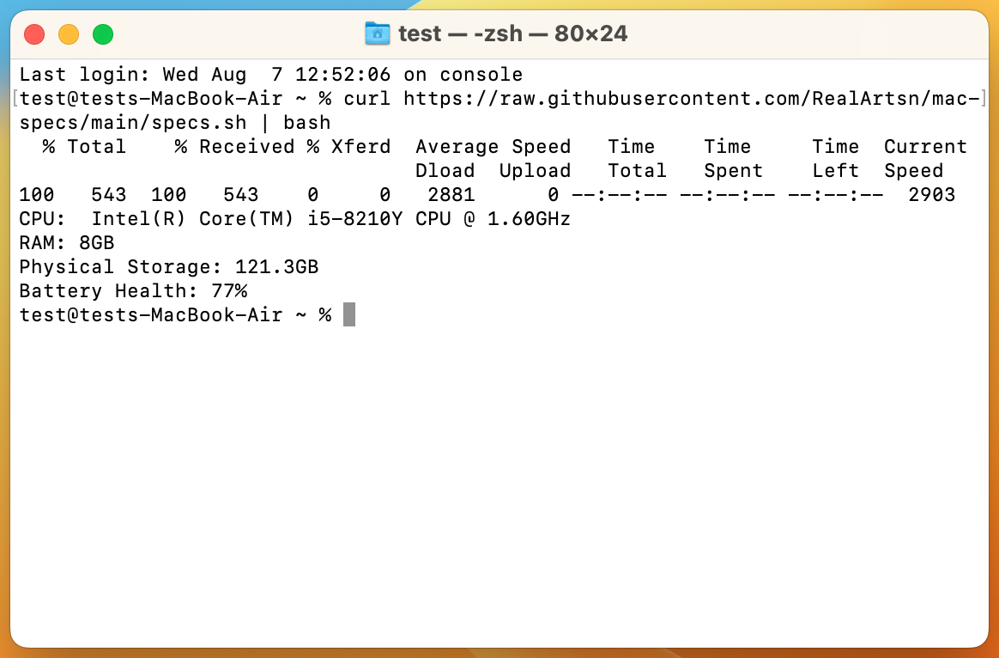

# mac-specs

## Overview
This script retrieves system specifications and battery health from the Mac terminal. This script was written for efficient documentation of MacBooks in recovery mode. 

## Usage

This script is intended to be used with `curl` and `bash` to reduce the time and effort spent with each machine. 

`curl https://raw.githubusercontent.com/RealArtsn/mac-specs/main/specs.sh | bash`
## QR Code
In addition, a QR scanner can be used with some models to reduce manual input. The following QR code contains the curl request and pipe to bash:

## Generating QR Codes
QR codes can be generated with `generate_qr.py`. This python script depends on the `segno` package. `python generate_qr.py` 

## Issues
This script has only seen extensive testing with Intel MacBooks and may not be fully functional on Apple Silicon machines.

`curl` has been observed to fail in recovery mode with `curl: (4) A requested feature, protocol or option was not found built-in in this libcurl due to a build-time decision.` in some versions of macOS recovery. This happens because the build of `libcurl` bundled with recovery does not always support TLS, which is required to make HTTPS connections. GitHub requires TLS, but this may be resolved booting into a different environment if the error is encountered. (See [Mac Startup Key Combinations](https://support.apple.com/en-us/102603)), by serving the script from an endpoint that does not require TLS, or by scanning in the entire script using the 'full' QR codes available on the [Releases](https://github.com/RealArtsn/mac-specs/releases) page.